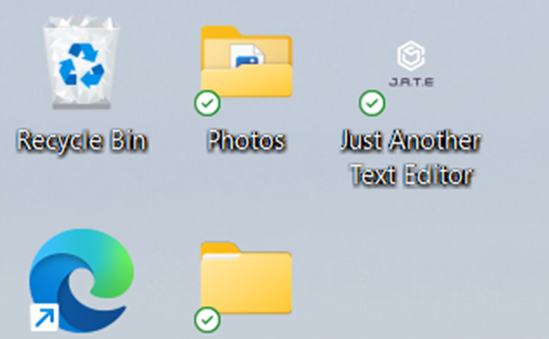
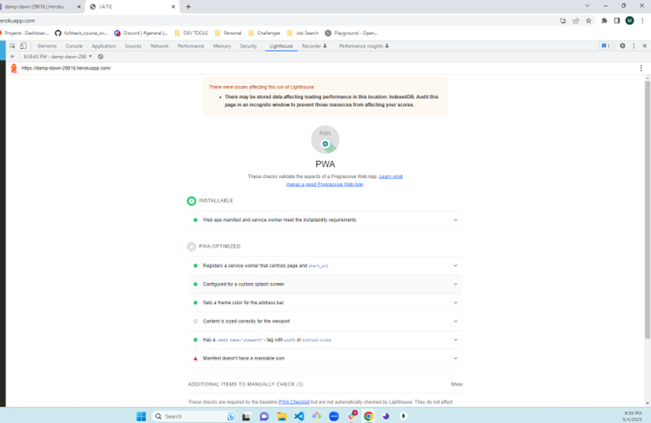

# Text Editor

## Description

This application is a text editor where a user can create small code snippets or simple notes. They can do this with or without internet. The notes and code can be viewed at a later time (with or without the internet). Just click the install button.

## Table of Contents

- [Installation](#installation)
- [License](#license)
- [Usage](#usage)
- [ScreenShots](#screenshots)
- [Video](#video)
- [Links to Deployment](#linkstodeployment)
- [Credits](#LinkstoDeployment)
- [Contribution](#contribution)
- [Tests](#tests)
- [Questions](#questions)

## Installation

1. Clone the repo
2. npm install
3. npm start
4. Visit Heroku page
5. Click the install button

## License

MIT

## Usage

1. Go to the Heroku deployed page
2. Enter in text or code
3. Click the install button
4. Refresh page and text and code will still be viewable

## ScreenShots

Desktop Icon

console.log

Manifest

Indexed DB

Service Worker

Light House Validate

## Video

n/a

## Links to Deployment

https://damp-dawn-29818.herokuapp.com/

https://github.com/MegMathis/Text_Editor

## Credits

https://www.youtube.com/watch?v=IZGNcSuwBZs

https://developer.mozilla.org/en-US/docs/Web/API/IndexedDB_API

https://www.npmjs.com/package/idb

https://web.dev/learn/pwa/installation-prompt/

https://www.amitmerchant.com/adding-custom-install-button-in-progressive-web-apps/

https://www.npmjs.com/package/workbox-webpack-plugin

https://github.com/googlechrome/workbox

https://github.com/arthurbergmz/webpack-pwa-manifest

https://www.npmjs.com/package/webpack-pwa-manifest?activeTab=readme

https://www.npmjs.com/package/babel-loader

https://hackernoon.com/jamie-maison-ff7d51058c32

https://developer.chrome.com/docs/workbox/

https://developer.chrome.com/docs/workbox/modules/workbox-strategies/

https://developer.chrome.com/docs/workbox/modules/workbox-routing/

https://developer.chrome.com/docs/workbox/modules/workbox-routing/

Instructors Walk Thru Application : https://github.com/jdtdesigns/idb_practice

Ask BCS

Office Hours

19-PWA Challenge#'s 15, 16, 19, 23, 25, and Mini Project

## Contribution

Megan Mathis

## Tests

n/a

## Questions

Any questions, please contact me at:

- GitHub:
  [MegMathis](http://github.com/MegMathis)
- Email:
  [mcdonough.megan25@gmail.com](mailto:mcdonough.megan25@gmail.com)
